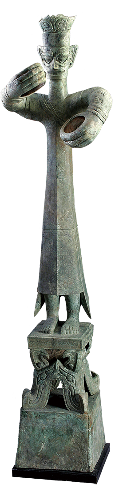
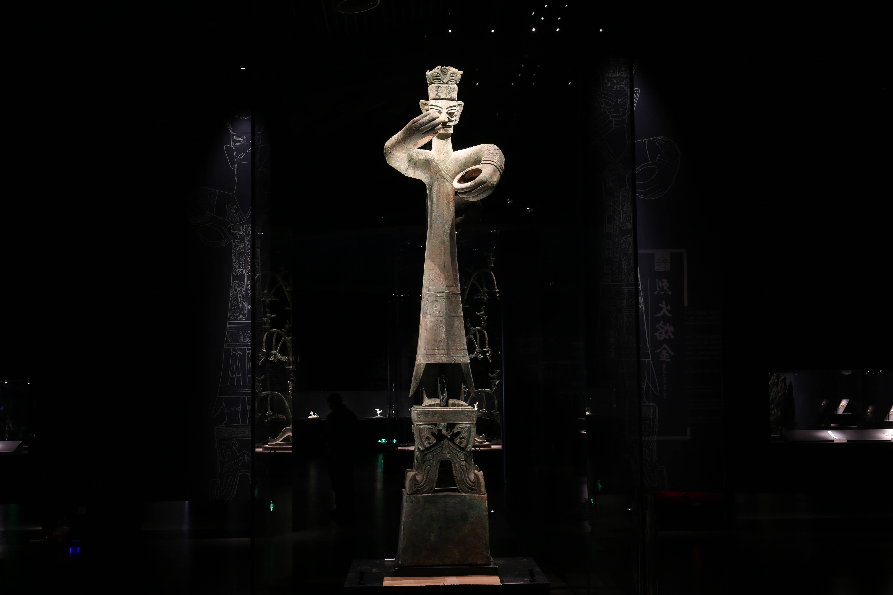
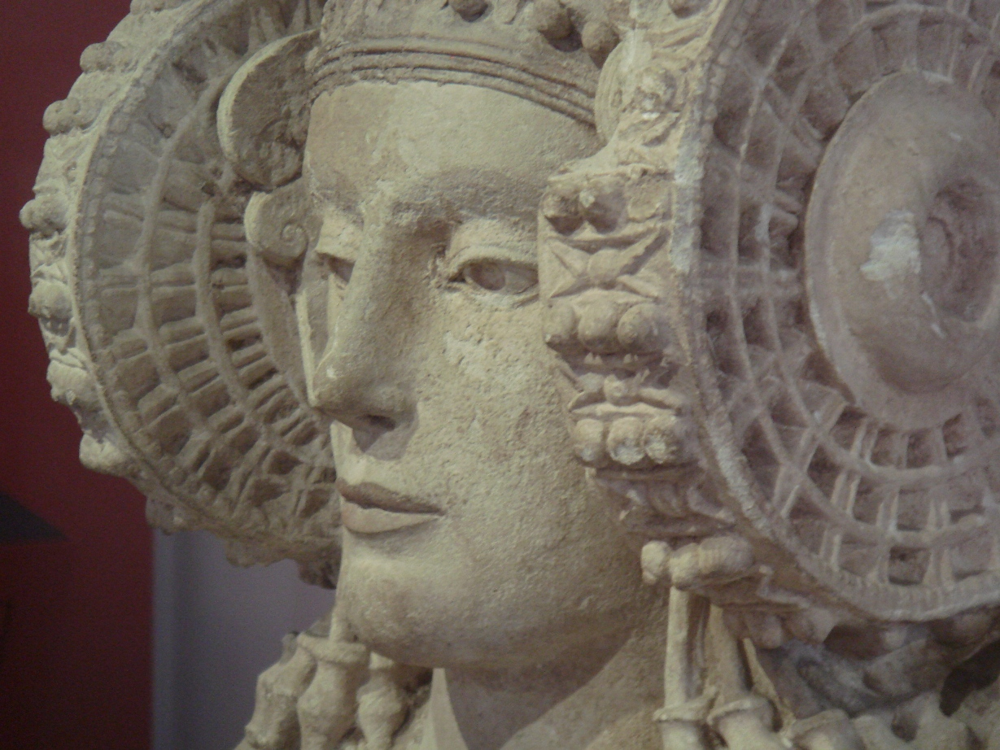
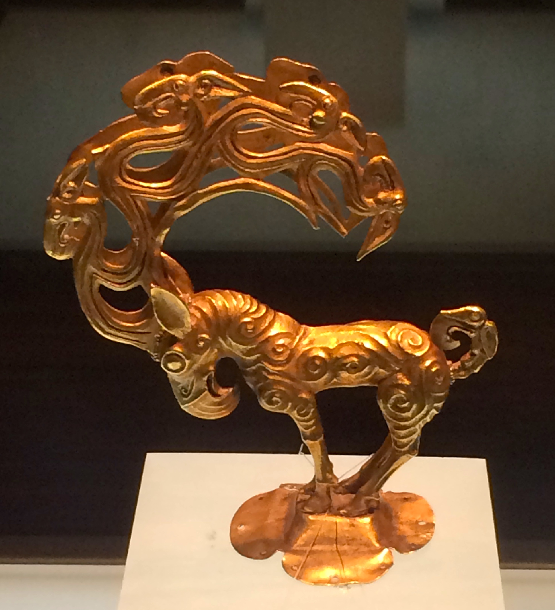
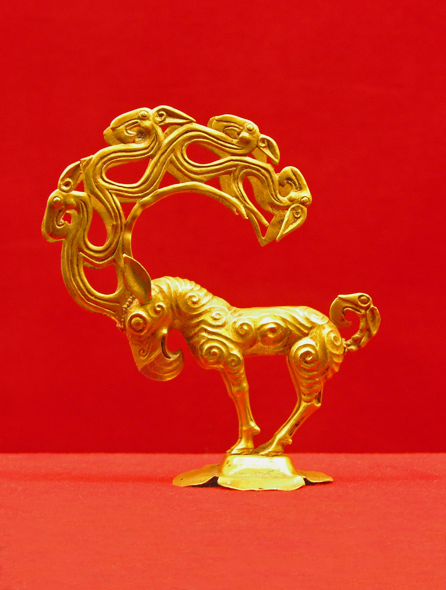

# 10,000 Years of Art

A list of art featured in Phaidon's *10,000 years of art* ([WorldCat](https://www.worldcat.org/title/308158805) to borrow from a nearby library; [Powells](https://www.powells.com/book/10000-years-of-art-9780714849690), [Goodreads](https://www.goodreads.com/book/show/6067824-10-000-years-of-art); ISBN 978-0-7148-4969-0) book, with links and images with credits.

Someday we may have all 500 pieces from the book here—not yet! Numbers refer to the page number in the book.

- [10,000 Years of Art](#10000-years-of-art)
  - [11 Dabous Giraffes](#11-dabous-giraffes)
  - [56 Shang Dynasty Large Standing Figure](#56-shang-dynasty-large-standing-figure)
  - [80 Nok Seated Dignitary](#80-nok-seated-dignitary)
  - [92 Greco-Iberian Lady of Elche](#92-greco-iberian-lady-of-elche)
  - [105 Eastern Zhou Dynasty/Warring States Period Gold Monster](#105-eastern-zhou-dynastywarring-states-period-gold-monster)
  - [128 Zapotec Bat Mask](#128-zapotec-bat-mask)
  - [234 Cahamana Santinatha Altarpiece](#234-cahamana-santinatha-altarpiece)
  - [235 Romanesque Norwegian](#235-romanesque-norwegian)

## 11 Dabous Giraffes
> 7,000 to 10,000 years ago. Niger. Engraving on rock. 600 cm. Dabous, between Agadez and Arlit, Niger.

Above: [Matthew Paulson](https://www.flickr.com/photos/matthewpaulson/6154211835/in/photolist-anPWLB) on Flickr, CC BY-SA-ND 2.0. A large relatively-flat stretch of rock largely parallel to the ground with a carving of two giraffes, the one on the left much larger than the one on the right, both facing left. The angle faces their feet. The outlines of both are carved but so are the individual irregular spots. Around the giraffes the rock bulges out, and in the background the desert floor shows the rock is a bit raised.

Above: from National Geographic Magazine, September 2008, photo by Mike Hettwer for story, "Green Sahara" ([magazine archive link](https://archive.nationalgeographic.com/national-geographic/2008-sep/flipbook/142/)). The image is taken from the left of the giraffes, near their heads, so the larger giraffe on the left is facing us. His face and ears are outlined, and a few spots near the back of his face are carved. Two figures squat beyond them in desert garb, one pointing at the second smaller giraffe. They are small compared to the giraffes. Smaller indistinct petroglyphs are above the large giraffe's head.

> Caption: "About the time prehistoric artists carved these life-size giraffes into an outcrop near the Aïr mountains, the Kiffian were living roughly 150 miles away in Gobero. Though their creator's identity remains a mystery, such petroglyphs record life flourishing during the Green Sahara."

Above: by the [Bradshaw Foundation](https://www.bradshawfoundation.com/giraffe/index.php), "Mapping the details of the carving". Another view of the larger giraffe from its feet, but the rock is overlaid with some long thin lengths of wood, and a person stands to the left writing notes. If the figure laid down, they might be as tall as the giraffe's leg.

Further reading:
- [Atlas Obscura](https://www.atlasobscura.com/places/dabous-giraffes)
- [US Department of State Magazine](https://1997-2001.state.gov/www/publications/statemag/statemag_sept2000/feature2.html) (2000)

## 56 Shang Dynasty Large Standing Figure
> Circa 1150 BCE. China. Bronze. 180 cm (figure), 260.8 cm (full height, including base). Sanxingdui Museum, Guanghan City, Sichuan Province.

Above from [Wikimedia](https://commons.wikimedia.org/wiki/File:Bronze_Colossal_Standing_Figure,_Sanxingdui_a.jpg), CC0 (public domain) license.

> This remarkable bronze statue, 2.6m (8.5ft) tall including its base, is the poster child (and traveling ambassador) for Sanxingdui. It is literally unique, the only complete figure of its size and kind that is currently known. ([Wikimedia](https://commons.wikimedia.org/wiki/File:Sanxingdui_Oct_2007_574.jpg))

(Also worth checking out is the ["Bronze statues of tall humans in Sanxingdui"](https://commons.wikimedia.org/wiki/Category:Bronze_statues_of_tall_humans_in_Sanxingdui) category on Wikimedia.)

Above from the [Sanxingdui Museum](https://www.sxd.cn/en/#/collection/detail/149), unknown license.

Above from the [virtual tour of the museum](https://vr.gumao.com/#/tour?id=ad23e8ca5c0a8abb), unknown license, this bronze is stop D-0.

Other coverage in English:
- [National Geographic](https://www.nationalgeographic.com/history/article/bronze-age-relics-sanxingdui-sichuan-china-walk) by Paul Salopek
- [Sixth Tone](https://www.sixthtone.com/news/1007021/Sanxingdui) by Cai Xuejiao and Liu Chuyue, with another brilliant example. 
- [Reddit](https://www.reddit.com/r/ArtefactPorn/comments/yxa5a3/a_large_bronze_standing_figure_262m_tall/): "A large bronze standing figure (2.62m tall including its base) excavated from the sacrificial pit No.2 at Sanxingdui Ruins. The figure originally held something in its hands (probably an elephant tusk, a pile of which were found buried on site). 1700-1150 BC, Sanxingdui Museum in China"

## 80 Nok Seated Dignitary
> Circa 500 BCE. Nigeria. Terracotta. 92.1 by 27.6 by 35.6 cm. Unkown location (was in Minneapolis Institute of Art but was deaccessioned (i.e., left there) 2014-12-09).

Above: uncredited image used in "France returns Nok Terracotta illegally exported from Nigeria" on [Daily Post](https://dailypost.ng/2016/05/18/france-returns-nok-terracotta-illegally-exported-from-nigeria/).

> The Nok culture of northern Nigeria, a civilization that existed from approximately 500 B.C. to about 500 A.D., is principally known for its terracotta figures. Relatively little is known about the purpose of these figures or the civilization that created such extraordinary sculptural representations of its people. A few of the remarkable characteristics that distinguish Nok pieces from terracottas of later cultures in Nigeria include the triangular, pierced eyes; the elaborate coiffure and beard; and the placement of the ears. This work depicts a person of high status wearing elaborate beaded jewelry, and with a crooked baton on his right arm and a hinged flail on the left. These are symbols of authority also found in ancient Egyptian depictions of the Pharaohs and the god Osiris. The Nok culture existed during the late Pharonic period and intra-African trading could have spread Egyptian influences into many other parts of Africa. (From [Minneapolis Institute of Art, archived by Archive.org](https://web.archive.org/web/20160310091558/https://collections.artsmia.org/art/5368/seated-dignitary-nok).)

According to this archived link, the Minneapolis Institute of Art deaccessioned this piece on 2014-12-09. In 2016, the [Daily Post](https://dailypost.ng/2016/05/18/france-returns-nok-terracotta-illegally-exported-from-nigeria/) and others reported that "France has formally presented to Nigeria an artifact, a Terracotta figurative sculpture that was repatriated after it was intercepted in France while in transit from Togo to the United States in 2008", which means it's unlikely to be this piece, however, those articles often used this image above.

While these are incredible pieces—see examples at [Wikipedia on Nok culture](https://en.wikipedia.org/wiki/Nok_culture)!—they are terribly trafficked, see
- ["Inside the illicit trade in West Africa’s oldest artworks"](https://mg.co.za/africa/2020-10-25-inside-the-illicit-trade-in-west-africas-oldest-artworks/) and
- ["Nok Terracottas" at Trafficking Culture](https://traffickingculture.org/encyclopedia/case-studies/nok-terracottas/)

Information on where this piece is now would be greatly appreciated, as would a credit for the image above.

## 92 Greco-Iberian Lady of Elche
> Circa 400 BCE. Spain. Painted limestone. 56 cm tall. Museo Arqueológico Nacional, Madrid, Spain.

Above from [Wikimedia](https://commons.wikimedia.org/wiki/File:Dama_de_Elche.jpg), via Museo Arqueológico Nacional, CC BY-CA 2.5.

> The Lady of Elche (in Spanish, Dama de Elche; in Valencian, Dama d'Elx) is a limestone bust that was discovered in 1897, at La Alcudia, an archaeological site on a private estate two kilometers south of Elche, Spain. It is generally known as an Iberian artifact from the 4th century BC, although the artisanship suggests strong Hellenistic influences. According to The Encyclopedia of Religion, the Lady of Elche is believed to have a direct association with Tanit, the goddess of Carthage, who was worshiped by the Punic-Iberians. ([Wikipedia](https://en.wikipedia.org/wiki/Lady_of_Elche))

Above from [Wikimedia: Manuel Parada López de Corselas](https://commons.wikimedia.org/wiki/File:DamaElche01.JPG), public domain.

## 105 Eastern Zhou Dynasty/Warring States Period Gold Monster
> Circa 300 BCE. China. Gold. 11.5 cm. Shaanxi History Museum, Xi'an.

Above from the [Shaanxi History Museum](https://www.sxhm.com/en/detail/767.html), unknown license.

> Unearthed from Shenmu County, Shaanxi Province in 1957. Standing on a lotus-shaped stand, the monster bends overprepare[d] to fight. It has a large horn which is divided four branches is decorated with a monster-head relief. Its tail is also decorated with a monster head. It rolls upward like a ring. This object is probably an ornamental object of the Hun people who lived in the steppe area of Northern China.

Above from [Wikimedia](https://commons.m.wikimedia.org/wiki/File:Gold_monster.jpg), CC-BY-SA 4.0 license.

Above from [Reddit](https://www.reddit.com/r/ArtefactPorn/comments/jlwyvw/a_gold_mythical_beast_from_the_eastern_zhou/), unknown license. "A gold mythical beast from the Eastern Zhou Dynasty, China. Warring States Period, c. 300 BC, now on display at the Shaanxi Provincial History Museum"

## 128 Zapotec Bat Mask
> Circa 50 BCE. Jadeite and shell. 38 cm. Oaxaca Gallery, Museo Nacional de Antropología, Mexico City, Mexico.

Above from [Wikimedia: Adrian Hernandez](https://commons.wikimedia.org/wiki/File:Mascara_Dios_Murcielago.jpg), CC BY-SA 4.0. "Zapotec vampire bat mosaic mask made of 25 pieces of jade, with yellow eyes made of shell."

Above montage from Wikimedia by Gary Todd ([a](https://commons.wikimedia.org/wiki/File:Zapotec_Jade_Bat_God,_Protoclassic,_Monte_Alban_II.jpg) and [b](https://commons.wikimedia.org/wiki/File:Zapotec_Jade_Bat_God,_Protoclassic,_Monte_Alban_II,_19cm.jpg), CC0 public domain), "Zapotec Jade Bat God, Protoclassic, Monte Alban II"

See also [Atlas Obscura](https://www.atlasobscura.com/places/mask-of-the-bat-god) entry: "This strange and sinister jade mask was discovered by archeologists excavating a tomb in the ruins of the ancient city of Monte Alban, once the heart of the powerful Zapotec civilization. Although some scholarly disagreement remains as to what purpose this mask served, it is overwhelmingly acknowledged that it portrays a bat… You can find the mask in the Oaxaca hall of the National Museum of Anthropology (Museo Nacional de Antropologia) in Chapultepec Park, along with many more batty artifacts."

## 234 Cahamana Santinatha Altarpiece
> 1168 CE. Rajasthan, India. Bronze, silver, and copper. 51.5 by 26.7 by 14 cm. Victoria and Albert Museum, London.

Above: from the [Victoria and Albert Museum](https://collections.vam.ac.uk/item/O25156/santinatha-figure-unknown/), under a license permitting personal study.

> Physical description: The meditating figure of Shantinatha (Santinatha), the 16th Jaina Tirthankara, is seated in the padmasana posture, on a jewelled cushion richly decorated with silver and copper inlay. There is a tiny figure of the deer which is the symbol (lanchana) of this Tirthankara. The figure is beautifully modeled, with finely articulated hands and feet. The symmetrical curls of hair frame a face of serene calm. The prominent srivatsa mark on the chest is inlaid with silver and copper. The eyes are silver and were probably once set with precious stones and crystal, now missing. An aureole is given behind the head with lotus design. A portion on top of the aureole is missing, perhaps it held a chatravali (umbrellas). The elaborate back-rest of the throne is cast in two sections, the lower section shows the fly-whisk bearers and the leogryphs and male figures. Two garland-bearers (maladharas or vidyadharas) and two seated four-armed female figures (yakshis) are shown on the throne-bar. Elephants and drummers are shown on top. A meditating male figure seated in the lalitasana posture is illustrated on top in the centre. We are unable to identify this important figure. Branches of the Kevala tree of the Jina also are shown on top with pots. This image of Shantinatha is one of the finest twelfth-century western Indian Jain monumental bronze castings recorded. The modelling and casting of the backplate, however, gives the appearance of not being contemporary. In all probability it was cast as a replacement, perhaps as late as the fifteenth century. An inscription on the base of the image confirms the identity of the Jina and the date of its dedication.

Gallery label:

> The Jina Shantinatha 1168; the backplate about 1300–1500 Jains revere twenty-four Jinas (spiritual victors) who showed the way to escape the cycle of death and rebirth and achieve liberation. These Jinas are also known as Tirthankaras (ford-makers). Shantinatha, the 16th Jina, is said to have revived Jainism at a time when it was in danger of extinction. In this rare example of large- scale medieval bronze casting, he sits meditating on a cushion, flanked by flywhisk bearers and felicitated by celestial musicians and garland bearers. Copper alloy with silver and copper inlay Probably western India (Rajasthan) With an inscription dedicating it to the triumph of Sri Shantinatha in the year of Vikrama-Samvat 1224 (1168 AD) Museum no. 930(IS) (06/06/2011)
>
> SANTINATHA Bronze Probably Rajasthan, Western India Cahamana period, dated to 1168 A.D. The meditating figure of Santinatha, the 16th Jain tirthankara, is seated on a cushion flanked by attendants holding fly-whisks (chauri). The highly elaborate backplate (torana) is decorated with celestial attendants, elephants and musicians. This is a rare example of monumental bronze-casting from the medieval period and bears an inscription dedicating it to the triumph of Sri Santinatha in the year of Vikrama-samvat 1224 (1168 A.D.). 930(IS) (c.1988-2010)

See [Flickr](https://flic.kr/p/brtHyS) for a closeup.

## 235 Romanesque Norwegian
> Circa 1150 to 1200 CE. Norway. Walrus ivory. 9.6 by 5 by 3.4 cm (156 grams). British Museum, London.

Above: side-by-side montage from the British Museum: [a](https://www.britishmuseum.org/collection/object/H_1831-1101-84) and [b](https://www.britishmuseum.org/collection/image/286228001), both CC BY-NC-SA 4.0, showing the front and back.

> Chess-piece; walrus ivory; queen wearing floriated crown over veil, mantle; holding horn; right hand placed on cheek; seated in chair ornamented on back with adjacent leaf scrolls with animal-heads on top of uprights; chair sides: interlace ornament.

Above: also from the [British Museum](https://www.britishmuseum.org/collection/image/1612939104), same license. Group shot of some of the Lewis Chessmen, including the queen above, as well as the king, a bishop, a knight, a pawn, and two small knobs? The king is bigger than the queen and is holding a sword in both hands across his knees. The bishop has a cleric's hat and staff and holding his other hand up in benediction. The helmeted knight is carrying a shield and riding a horse. The pawn is half the size of the rest, wearing a helmet, holding a sword and shield.
